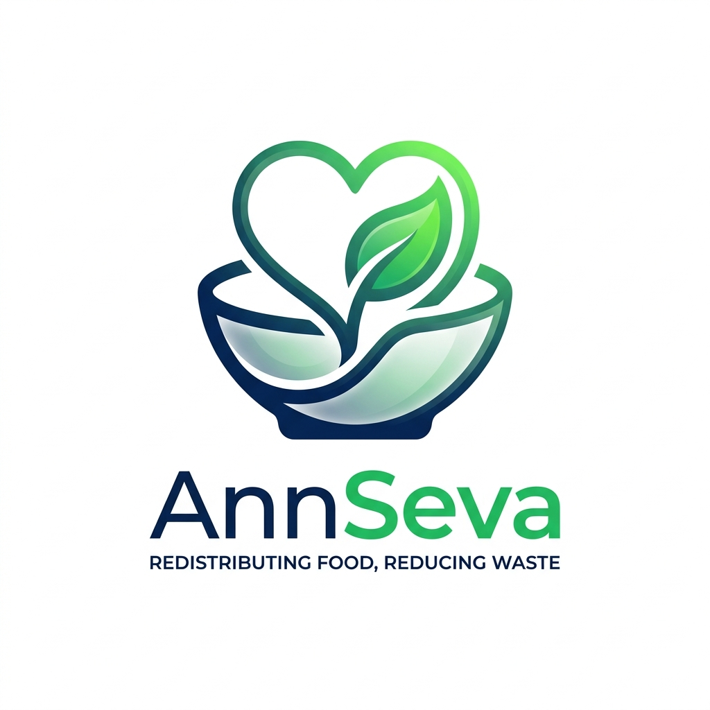

<p align="center">
  
</p>

<h1 align="center">
  🍽️ AnnSeva — Zero Food Waste Platform
</h1>

<p align="center">
  <strong>Bridging the gap between surplus food and hungry stomachs — in real time.</strong>
</p>

<p align="center">
  <a href="https://nextjs.org"></a>
  <a href="https://firebase.google.com"></a>
  <a href="https://www.typescriptlang.org"></a>
  <a href="https://vercel.com"></a>
  <a href="LICENSE"></a>
</p>

<p align="center">
  <a href="#-features">Features</a> •
  <a href="#-tech-stack">Tech Stack</a> •
  <a href="#-screenshots">Screenshots</a> •
  <a href="#-quick-start">Quick Start</a> •
  <a href="#-architecture">Architecture</a> •
  <a href="#-deployment">Deployment</a> •
  <a href="#-mobile-app">Mobile App</a>
</p>

---

## 🌟 About

> **"In India alone, 40% of food produced is wasted, while 190 million go hungry every day."**

**AnnSeva** (अन्नसेवा — _"Service through Food"_) is a centralized food redistribution platform that connects **restaurants** with surplus food to **volunteers** who deliver it to underprivileged communities — all orchestrated through a **real-time dashboard**.

### 🎯 The Problem
- 🚮 **Restaurants** throw away perfectly good food daily
- 😔 **Millions** of people go to bed hungry
- 🔗 There's **no efficient bridge** between surplus and need

### ✅ Our Solution
AnnSeva provides a **real-time platform** where:
1. 🏪 **Restaurants** list surplus food with quantity, expiry time & location
2. 🙋 **Volunteers** accept pickups and deliver food to communities
3. 🛡️ **Admins** monitor everything via a powerful analytics dashboard

---

## ✨ Features

### 🏪 Restaurant Dashboard
| Feature | Description |
|---------|-------------|
| 📝 **Add Food Listings** | Post surplus food with name, quantity, expiry time, and address |
| 📋 **My Listings** | View all your listings with real-time status tracking |
| 📊 **Overview** | Quick stats — total listed, active, picked up, delivered |
| 🗺️ **Auto Location** | Interactive Leaflet map with geocoding for address |

### 🙋 Volunteer Portal
| Feature | Description |
|---------|-------------|
| 🔍 **Available Food** | Browse real-time food listings on an interactive map |
| ✅ **Accept Pickup** | One-click accept with instant status update |
| 📦 **My Pickups** | Track your accepted pickups — Accepted → Picked → Delivered |
| 📍 **Navigation** | Get directions to the restaurant location |

### 🛡️ Admin Panel
| Feature | Description |
|---------|-------------|
| 📊 **Analytics Dashboard** | Total users, listings, pickups with trend charts |
| 👥 **User Management** | View all registered users with role & activity |
| 📋 **All Listings** | Monitor every food listing across the platform |
| 🔍 **Real-time Monitoring** | Live status updates across all actors |

### 🎨 Design & UX
- 🌙 **Premium Dark Theme** — Navy + emerald green accents
- ✨ **Framer Motion Animations** — Smooth page transitions & micro-interactions
- 📱 **Fully Responsive** — Works flawlessly on mobile, tablet & desktop
- 🔐 **Role-based Access** — Automatic redirect based on user role
- 🔥 **Real-time Updates** — Firestore `onSnapshot` for live data

---

## 🛠️ Tech Stack

<table>
  <tr>
    <td align="center" width="120">
      
      <br /><strong>Next.js 16</strong>
      <br /><sub>App Router</sub>
    </td>
    <td align="center" width="120">
      
      <br /><strong>TypeScript</strong>
      <br /><sub>Type Safety</sub>
    </td>
    <td align="center" width="120">
      
      <br /><strong>Firebase</strong>
      <br /><sub>Auth + Firestore</sub>
    </td>
    <td align="center" width="120">
      
      <br /><strong>CSS3</strong>
      <br /><sub>Custom Design System</sub>
    </td>
    <td align="center" width="120">
      
      <br /><strong>React 19</strong>
      <br /><sub>UI Framework</sub>
    </td>
  </tr>
</table>

| Category | Technology |
|----------|-----------|
| **Framework** | Next.js 16 (App Router + Turbopack) |
| **Language** | TypeScript 5.x |
| **Backend** | Firebase Auth + Cloud Firestore |
| **Styling** | Vanilla CSS (Custom Design System) |
| **Maps** | Leaflet.js + OpenStreetMap |
| **Animations** | Framer Motion |
| **Icons** | Lucide React |
| **Toasts** | React Hot Toast |
| **Fonts** | Inter + Space Grotesk (Google Fonts) |
| **Deployment** | Vercel |

---

## 📸 Screenshots

<details>
<summary><strong>🏠 Landing Page</strong></summary>
<br />

> A stunning hero section with animated stats, feature cards, and a CTA — all in a premium dark theme with glassmorphism effects.

**Key Elements:**
- Animated hero text with gradient accents
- Live stat counters (Meals Saved, Volunteers, Restaurants, Cities)
- Feature cards with hover effects
- Responsive navigation

</details>

<details>
<summary><strong>🔐 Authentication</strong></summary>
<br />

> Clean, modern login & signup pages with role selection (Restaurant / Volunteer / Admin).

**Features:**
- Email/password authentication via Firebase
- Role selector with visual indicators
- Form validation with error toasts
- Auto-redirect to role-specific dashboard

</details>

<details>
<summary><strong>🏪 Restaurant Dashboard</strong></summary>
<br />

> Restaurants can add food listings with an interactive map, view their listings, and track pickup status in real time.

**Features:**
- Add food modal with quantity, expiry, and map location
- Real-time listing status (Available → Accepted → Picked → Delivered)
- Overview cards with stats

</details>

<details>
<summary><strong>🛡️ Admin Panel</strong></summary>
<br />

> Full platform analytics and user management.

**Features:**
- Total users, listings, and pickups overview
- User table with role badges
- All listings with status filters

</details>

---

## 🚀 Quick Start

### Prerequisites

- **Node.js** 18+ 
- **Firebase Project** with Firestore + Auth enabled

### 1. Clone the Repository

```bash
git clone https://github.com/MD-HACKER07/AnnSeva-Web.git
cd AnnSeva-Web
```

### 2. Install Dependencies

```bash
npm install
```

### 3. Configure Firebase

Create a `.env.local` file in the root:

```env
NEXT_PUBLIC_FIREBASE_API_KEY=your_api_key
NEXT_PUBLIC_FIREBASE_AUTH_DOMAIN=your_project.firebaseapp.com
NEXT_PUBLIC_FIREBASE_PROJECT_ID=your_project_id
NEXT_PUBLIC_FIREBASE_STORAGE_BUCKET=your_project.firebasestorage.app
NEXT_PUBLIC_FIREBASE_MESSAGING_SENDER_ID=your_sender_id
NEXT_PUBLIC_FIREBASE_APP_ID=your_app_id
```

### 4. Run Development Server

```bash
npm run dev
```

Open [http://localhost:3000](http://localhost:3000) 🎉

---

## 🏗️ Architecture

```
┌───────────────────────────────────────────────┐
│                    CLIENTS                     │
│  ┌─────────────┐          ┌─────────────────┐ │
│  │  Web App    │          │  Mobile App     │ │
│  │  (Next.js)  │          │  (Flutter)      │ │
│  └──────┬──────┘          └────────┬────────┘ │
└─────────┼──────────────────────────┼──────────┘
          │                          │
          ▼                          ▼
┌───────────────────────────────────────────────┐
│               FIREBASE BACKEND                 │
│  ┌──────────────┐  ┌──────────────────────┐   │
│  │  Firebase    │  │  Cloud Firestore     │   │
│  │  Auth        │  │  ┌────────────────┐  │   │
│  │  • Email/Pwd │  │  │ users          │  │   │
│  │  • Roles     │  │  │ food_listings  │  │   │
│  └──────────────┘  │  │ pickups        │  │   │
│                    │  └────────────────┘  │   │
│                    └──────────────────────┘   │
└───────────────────────────────────────────────┘
```

### 📁 Project Structure

```
annseva-web/
├── public/
│   └── logo.png                    # App logo
├── src/
│   ├── app/
│   │   ├── layout.tsx              # Root layout + metadata
│   │   ├── page.tsx                # Landing page
│   │   ├── globals.css             # Design system + all styles
│   │   ├── login/page.tsx          # Login page
│   │   ├── signup/page.tsx         # Signup with role selector
│   │   └── dashboard/
│   │       ├── page.tsx            # Role-based redirect
│   │       ├── restaurant/         # Restaurant pages
│   │       │   ├── page.tsx        # Overview
│   │       │   ├── add/page.tsx    # Add food listing
│   │       │   └── listings/page.tsx # My listings
│   │       ├── volunteer/          # Volunteer pages
│   │       │   ├── page.tsx        # Available food + map
│   │       │   └── pickups/page.tsx # My pickups
│   │       └── admin/              # Admin pages
│   │           └── page.tsx        # Analytics dashboard
│   ├── components/
│   │   ├── Sidebar.tsx             # Role-based sidebar navigation
│   │   ├── AddFoodModal.tsx        # Food listing form modal
│   │   └── MapView.tsx             # Leaflet map component
│   ├── context/
│   │   └── AuthContext.tsx         # Firebase auth context
│   └── lib/
│       ├── firebase.ts             # Firebase config + init
│       └── firestore.ts            # Firestore CRUD operations
├── next.config.ts
├── tsconfig.json
└── package.json
```

### 🗃️ Firestore Schema

```
📁 users/{uid}
├── name: string
├── email: string
├── phone: string
├── role: "restaurant" | "volunteer" | "admin"
└── createdAt: Timestamp

📁 food_listings/{id}
├── foodName: string
├── quantity: string
├── description: string
├── address: string
├── lat: number
├── lng: number
├── expiryTime: string
├── status: "available" | "accepted" | "picked" | "delivered"
├── restaurantId: string
├── restaurantName: string
├── acceptedBy: string | null
└── createdAt: Timestamp

📁 pickups/{id}
├── listingId: string
├── foodName: string
├── quantity: string
├── address: string
├── restaurantName: string
├── volunteerId: string
├── volunteerName: string
├── status: "accepted" | "picked" | "delivered"
└── acceptedAt: Timestamp
```

---

## 🌐 Deployment

### Deploy to Vercel (Recommended)

1. **Push to GitHub** (already done ✅)
2. **Go to** [vercel.com](https://vercel.com) → Sign in with GitHub
3. **Import Project** → Select `AnnSeva-Web` repository
4. **Add Environment Variables:**
   
   | Key | Value |
   |-----|-------|
   | `NEXT_PUBLIC_FIREBASE_API_KEY` | Your Firebase API key |
   | `NEXT_PUBLIC_FIREBASE_AUTH_DOMAIN` | `your-project.firebaseapp.com` |
   | `NEXT_PUBLIC_FIREBASE_PROJECT_ID` | Your project ID |
   | `NEXT_PUBLIC_FIREBASE_STORAGE_BUCKET` | `your-project.firebasestorage.app` |
   | `NEXT_PUBLIC_FIREBASE_MESSAGING_SENDER_ID` | Your sender ID |
   | `NEXT_PUBLIC_FIREBASE_APP_ID` | Your app ID |

5. **Deploy** 🚀

> ⚡ Vercel auto-detects Next.js — zero config needed!

---

## 📱 Mobile App

The companion Flutter mobile app is available at:

👉 **[AnnSeva-App](https://github.com/MD-HACKER07/AnnSeva-App)**

Both apps share the same Firebase backend, enabling real-time sync between web and mobile.

---

## 🤝 Contributing

Contributions are welcome! Here's how:

1. Fork the repository
2. Create your feature branch (`git checkout -b feature/amazing-feature`)
3. Commit your changes (`git commit -m 'Add amazing feature'`)
4. Push to the branch (`git push origin feature/amazing-feature`)
5. Open a Pull Request

---

## 📜 License

This project is licensed under the MIT License — see the [LICENSE](LICENSE) file for details.

---

## 👨‍💻 Author

<p align="center">
  Made with ❤️ by <a href="https://github.com/MD-HACKER07"><strong>MD-HACKER07</strong></a>
  <br />
  <sub>Building technology to solve real-world problems</sub>
</p>

<p align="center">
  <a href="https://github.com/MD-HACKER07">
    
  </a>
</p>

---

<p align="center">
  <strong>⭐ Star this repo if you believe in zero food waste! ⭐</strong>
</p>
